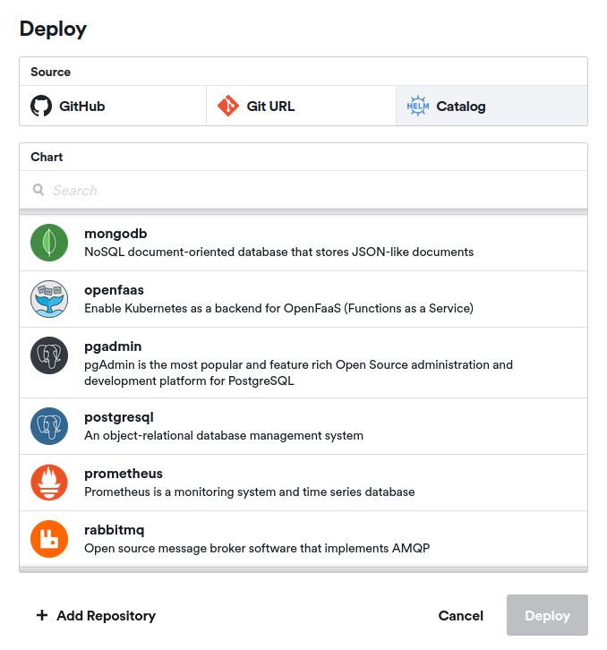
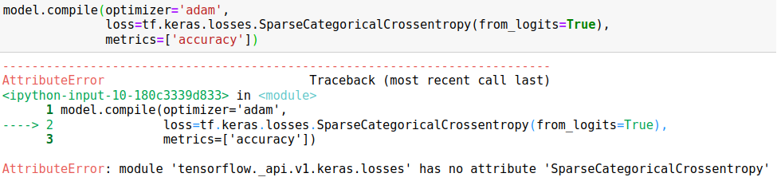
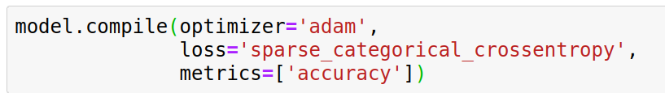
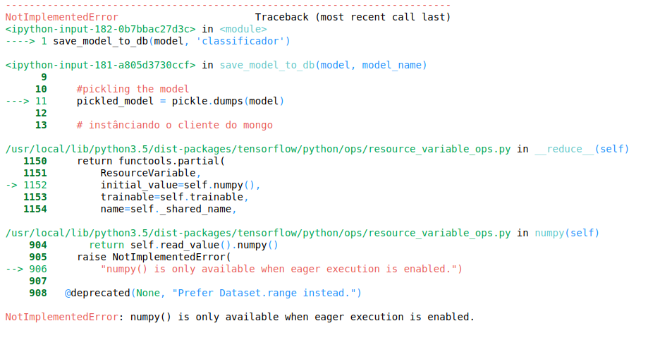
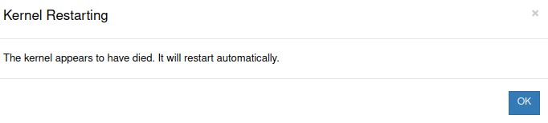
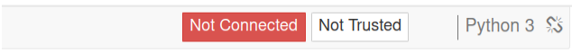
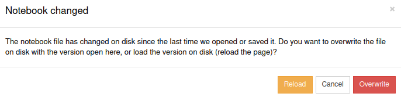

# 🟢 Avaliação Sprint 3 - Programa de Bolsas Compass.uol e UFMS 🟢
# Acesso ao Projeto
- Para executar o notebook é necessário acessar o link [clicando aqui](https://jupyter-tensorflow-notebook-viniciusmarchi.cloud.okteto.net/notebooks/cifar10-model.ipynb). A senha de acesso é "okteto", caso exigida. 
---
# Desenvolvimento
## Bibliotecas utilizadas
* [numpy](https://numpy.org/)
* [tensorflow](https://www.tensorflow.org/)
* [matplotlib](https://matplotlib.org/)
* [pymongo](https://pymongo.readthedocs.io/en/stable/)
* [gridfs](https://pymongo.readthedocs.io/en/stable/examples/gridfs.html)
* [bson](https://docs.mongodb.com/manual/reference/bson-types/)
* [Ipython](https://ipython.org/)

## Deploy no okteto
Para realizar o deploy no okteto utilizamos o catálogo disponibilizado dentro da própria plataforma, como mostra a imagem abaixo, o qual se encarrega de construir imagens pré-definidas e disponibilizar os pods já funcionando.



Deste catálogo além dos pods para o Jupyter Notebook, criamos também para o banco de dados Mongo. Dessa forma, ficou simples estabelecer uma entre o Jupyter e o banco de dados.

## DataSet
 O dataset escolhido foi o [CIFAR10](https://www.tensorflow.org/tutorials/images/cnn) que consiste em uma rede convulacional que reconhece padrões diversos em imagens, baseado nas seguintes classes: 
  * Avião (airplane)
  * Automóvel (automobile)
  * Cachorro (dog)
  * Caminhão (truck) 
  * Cavalo (horse)
  * Cervo (deer)
  * Gato (cat)
  * Navio (ship)
  * Passaro (bird)
  * Sapo (frog)

Vale ressaltar que a pasta denominada "Dataset", contida neste repositório, não representa o dataset CIFAR10, pois esse é baixado e armazenado em memória apenas durante as fases de treinamento, validação e teste do modelo. A pasta "Dataset" armazena as imagens obtidas da internet pelo grupo para realizar inferências.


## Modelo
O modelo utilizado é uma CNN, Convolutional neural network (Rede neural convolucional) simples.

O modelo receberá como input dados no formato (32, 32, 3), pois o dataset CIFAR10 define imagens de dimensionalidade 32x32. Além disso, são coloridas, ou seja, possuem 3 canais de cores. Com isso temos o seguinte modelo:

```
model = tf.keras.Sequential([
    layers.Conv2D(32, (3, 3), activation='relu', input_shape=(32, 32, 3)),
    layers.MaxPooling2D((2, 2)),
    layers.Conv2D(64, (3, 3), activation='relu'),
    layers.MaxPooling2D((2, 2)),
    layers.Conv2D(64, (3, 3), activation='relu'),
    layers.Flatten(),
    layers.Dense(64, activation='relu'),
    layers.Dense(10, activation=tf.keras.activations.softmax)
])
```
Na primeira camada convolucional `layers.Conv2D(32, (3, 3), activation='relu', input_shape=(32, 32, 3))` são definidos parâmetros que especificam o número de features a serem aprendidas, no caso: 32 features para um array 2D no formato 3x3. Essa informação tem relação com o formato de das imagens de entrada, como mostra o parâmetro `input_shape`, que garante a dimensionalidade dos inputs no formato 32x32, representados por um array 3D, pois são imagens coloridas, com 3 canais de cores. Além disso, também definimos a função de ativação ReLU para dessa camada.

Na camada seguinte `layers.MaxPooling2D((2, 2))` acontece o agrupamento (pooling) para alterar o tamanho do mapa de features gerado pela primeira camada de convolução.

De maneira sequencial, essa estrutura se repete, uma camada Conv2D seguida de MaxPooling2D, seguida de Conv2D. A única diferença é que essas camadas Conv2D seguintes aprenderão 64 features.

Após a última camada Conv2D existe a camada de Flatten `layers.Flatten()` onde acontece o achatamento que converte a estrutura de dados 2D resultante da camada Conv2D anterior em uma estrutura 1D, uma simples lista. Por fim, esse dado é passado para as últimas camadas da estrutura, sendo uma camada totalmente conectada (Fully Connected layer) e uma camada de saída (output layer).

A camada totalmente conectada `layers.Dense(64, activation='relu')` é a definição da rede neural que realizará a classificação do dado. Essa camada recebe as 64 features resultantes do processamento realizado pelas camadas anteriores.

A última camada (output layer) gera 10 valores, pois o problema de classificação do dataset CIFAR10 contém 10 possíveis classes para uma imagem. Cada valor representa a interpretação do modelo para o dado em relação a cada classe. De maneira bem simples é possível dizer que o maior desse valores representa a classe que o modelo teve mais certeza de ser a classe que caracteriza o dado. Além disso, essa camada possui a função de ativação [Softmax](https://www.tensorflow.org/api_docs/python/tf/nn/softmax), que transforma esses 10 valores em uma distribuição de probabilidades, sendo a maior probabilidade a classe prevista pelo modelo, facilitando a interpretação do resultado.

Com o modelo definido, o compilamos utilizando o otimizador [Adam](https://www.tensorflow.org/api_docs/python/tf/keras/optimizers/Adam) e a loss [Sparse Categorical Cross-Entropy](https://www.tensorflow.org/api_docs/python/tf/keras/losses/SparseCategoricalCrossentropy) utilizada quando os labels do dataset não são [one hot encoding](https://en.wikipedia.org/wiki/One-hot), como no caso.

```
model.compile(optimizer='adam',
              loss='sparse_categorical_crossentropy',
              metrics=['accuracy'])
```
# Problemas encontrados

## Arquivos sumindo do Okteto
O primeiro problema enfrentado por nós foi o desaparecimento dos arquivos contidos no okteto. De maneira inexplicável, de um dia para o outro, todos os arquivos contidos na pasta do okteto sumiram. Incluindo o jupyter notebook, contendo o código.
Esse comportamento se mostrou recorrente em outros deploys.

## Versão desatualizada do Tensorflow
Ao realizar o deploy do jupyter notebook diretamente do catálogo disponibilizado no okteto, como comentado, percebemos um problema. O oketo apresentou um comportamento inconsistente em relação ao versionamento do tensorflow. Em instâncias diferentes de deploy, criadas em momentos diferentes, mas no mesmo dia, o okteto apresentou versões diferentes do tensorflow. Na primeira instância obtivemos a versão 1.12.0 (versão oficial disponibilizada pelo okteto), enquanto que na segunda obtivemos a versão 1.14.0.

Além disso, consideramos que a versão 1.12.0, se encontra desatualizada, visto que o tensorflow se encontra, atualmente, na versão 2.7. Entretanto não conseguimos atualizar o tensorflow pois todas as outras libs, até mesmo o próprio python, se encontravam em versões incompatíveis com o tensorflow mais atualizado. A atualização de todo o ambiente não foi possível, sempre que tentávamos o okteto reinicializava o notebook, apenas conseguimos atualizar libs específicas, então optamos por continuar com o tensorflow na versão 1.12. Entretanto, isso gerou dificuldades para encontrar documentos, tutoriais e libs que funcionassem sem erros com essa versão, porém isso foi contornado e não influenciou no desenvolvimento.

O problema mais grave encontrado foi um comportamento inesperado de *não* convergência do modelo. Utilizamos como base a documentação do tensorflow para construir o modelo capaz de resolver o problema de classificação apresentado pelo dataset CIFAR10, entretanto obtemos um erro, uma função, descrita pela documentação, ainda não existia, devido a versão desatualizada, como mostra a figura abaixo:

Como mostra a figura: 



Então, buscando por versões anteriores da documentação, encontramos a maneira correta para a versão 1.12, como mostra a figura abaixo:



Nesse momento, o comportamento inesperado de não convergência aconteceu. O modelo deixou de convergir. Inexplicavelmente, permanecendo durante 10 épocas de treinamento com o *exato* mesmo valor de loss e accuracy, como se não estivesse sendo otimizado de fato. Esse comportamento inesperado não lançou nenhum erro por parte do tensorflow, o que dificultou a compreensão da situação, então, simplesmente realizando outro deploy de jupyter notebook, o erro foi corrigido, entretanto ele foi observado em outros momentos.

Não sabemos o que causou esse comportamento, mas conseguimos resolvê-lo apenas recriando a instancia do jupyter notebook, assim conseguindo treinar o modelo normalmente.

## Erro ao utilizar Pickle
Na versão 1.12 não foi possível utilizar a lib Pickle para serializariar o arquivo que representa o modelo gerado pelo tensorflow, a fim de tornar possível sua inserção no banco de dados.



Esse erro foi encontrado em issues no repositório do Tensorflow, por isso optamos por utilizar outra lib para realizar esse processo, o GridFS.

## Erro de conexão e reinicialização do notebook
Por fim, um erro não relacionado ao código, mas a plataforma em si, que causou empecilhos, foi o erro de conexão do okteto. Esporadicamente (até mesmo no meio do treinamento do modelo) o oketo enviava uma mensagem de erro informando que aconteceram problemas no kernel, como mostra a figura abaixo:



Esse erro precedia a desconexão completa do jupyter notebook, o qual ficava inoperante, como mostra a figura abaixo. 



Essa desconexão causava a perda de todas as variáveis instanciadas e seus valores armazenados em memória, o que exigia a completa reexecução do notebook. Em outras palavras, precisamos executar novamente todas as células, inclusive a que treinava o modelo, caso esse erro tivesse acontecido durante seu treinamento, antes que o mesmo finalizasse para que pudéssemos salvar o modelo em disco.

Além disso, a construção de código de modo colaborativo
de maneira simultânea era impossibilitado, pois quando um integrante do grupo alterava o jupyter notebook, os demais recebiam o aviso exibido pela figura abaixo. O qual, caso acontecesse muitas vezes, também gerava uma reinicialização do notebook. Esse problema em questão não afetou o desenvolvimento pois é facilmente contornado, mas é uma questão interessante, por isso foi descrita nesse documento.



## Desenvolvido por 
- 👩‍💻 Anália Beatriz
- 👨‍💻 Leonardo Oliveira
- 👨‍💻 Vinicius Marchi 

---
